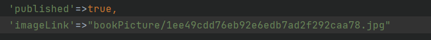

## A Propos de ce projet

Ce projet est une application de librairie(Livres,Chapitres) qui reuinit Laravel et VueJs grâce à Inertia

## Integration

1. Lancer la commande `composer install`

2. Installer les dépendances en lançant la commande `npm install`

3. Faites une copie de votre fichier .env
`cp .env.example .env`

4. Génénez une clé d'encryption
`php artisan key:generate`

5. Nettoyez le projet
`php artisan cache:clear`
6. Vous devez ensuite créer un dossier 'bookPicture' dans **"storage/app/public"**
7. Ajoutez ensuite un fichier photo à ce dossier et modifier le chemin dans **"database/factories/BookFactory"** comme dans la capture suivante

- Vous également Changer le mail et le Nom de votre utlisateur par défaut dans **"database/seeders/DatabaseSeeder"**
8. Vous pouvez ensuite créer une base de données et configurer votre fichier .env en conséquence
9. Vous pouvez faire les migrations et alimenter la base de données en lançant la commande
`php artisan migrate:fresh --seed`
10. Et enfin lancez la commande `php artisan storage:link`

## Lancement de l'application

1. Lancez premièrement le projet Laravel
`php artisan serve`
2. Ensuite lancez le client Vue
`npm run dev`

## Utilisation
- Pour vous connecter utiliser la route '/login' et l'utlisateur présent dans DatabaseSeeder(test@example.com) avec le mot de passe
**"password"**
